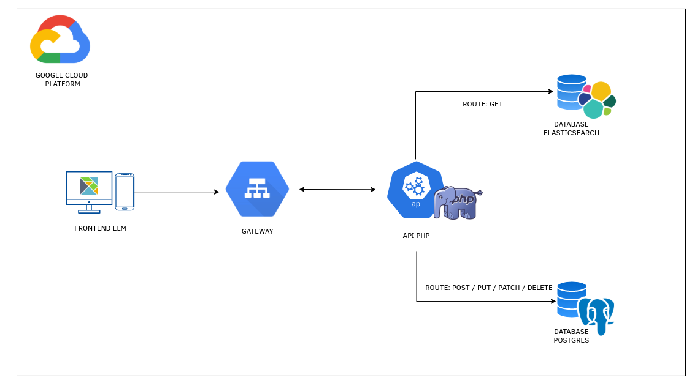

# REAL ESTATE

#### ERP for Real Estate Agents

---

 

`Description` *-*  Complete control of the sectors of a Real Estate company. Management of brokers, customers, real estate and developments, of 
                the company itself as well as in partnership with third parties.

 

---

### Index

[TECHNICAL REQUIREMENTS](#technical-requirements)

[ARCHITECTURE](#architecture)

[DOMAINS](#domains)

[FLOW](#flow)

[COMMANDS](#commands)

  

---

### Technical Requirements

* Language: 
    * Backend:
        * PHP  &nbsp;&nbsp; *Mezzio framework*
    * Frontend: 
        * Elm

* Webserver: 
    * Nginx
    
* Database: 
    * Domain: 
        * Postgres
    * Search: 
        * Elasticsearch        
   
* Infrastructure: 
    * Cloud: 
        * GCP
    * Container Management: 
        * Docker
   
 

---

### Architecture

* `/config` *-* Contains files of micro framework configuration.
    
  * `/autoload` *-* Contains configuration files that are automatically loaded with the microframework, as the upload settings for middlewares,
                    helpers, factories etc. 
    * `development.global.php` *-* Archive which has some global settings that are used throughout the microframework, such as the settings, for 
                    example.
    * `development.local.php` *-* Archive contains settings that are used only in development environment, such as errors, for example. Another 
                    important point is that this file must not be versioned.
    * `development.local.php.dist` *-* This extension tells you that the file is a template and can be versioned, so the developer who updates 
                    the project must copy this file and remove the extension *.dist*.
    
* `/ src` *-* Where each module of the project is located. A module is a fully decoupled Application Domain.

  * Access:
    * Domain responsible for managing those who access the system.
  * Company: 
    * Domain responsible for managing the companies that acquired the project, through a multi-tenant system. 
  * Login: 
    * Domain responsible for managing access to the system.
    
* `/test` *-* Where tests are located.

* `/vendor` *-* Contains all libraries used by the application, that is, it is a directory created by Composer when we install it, containing all 
                    the required libraries. If in the future it is necessary include a new library, Composer will save to that directory.
                    
  

---

### Domains

 

---

### Flow

  

---

### Commands

* Create a new module: 
   * `composer mezzio module:create <module-name>`  
* Create a new handler: 
   * `composer mezzio handler:create <handler\\path\\name>`